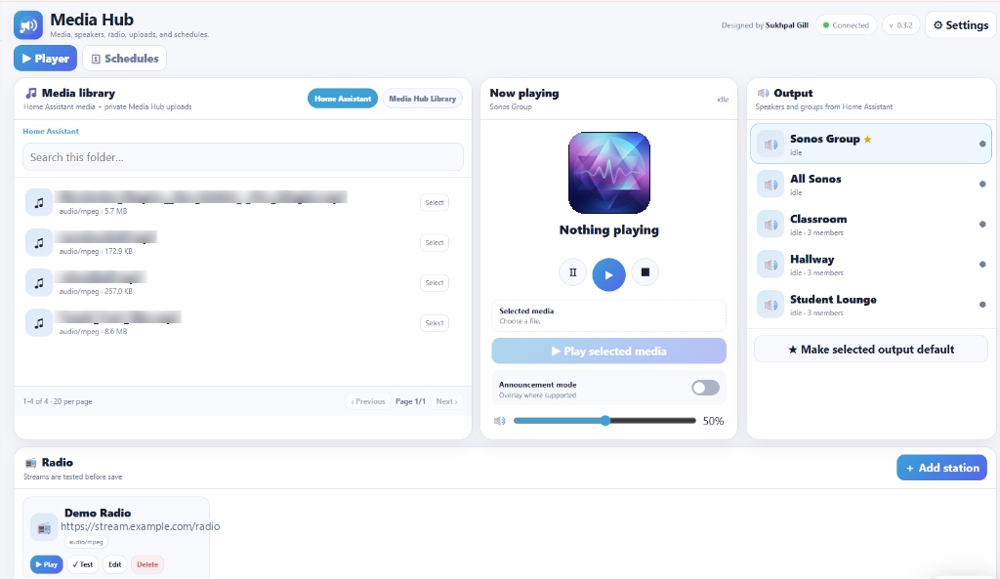
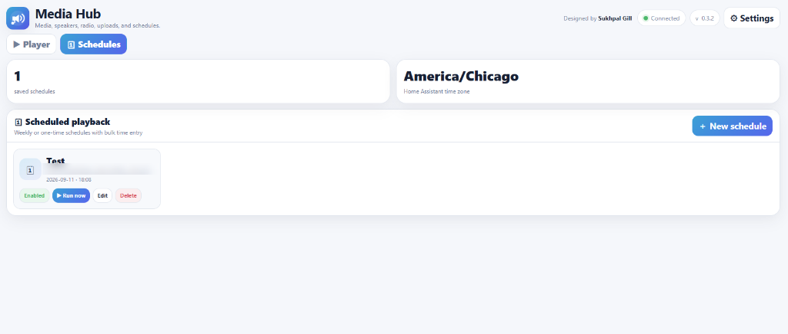
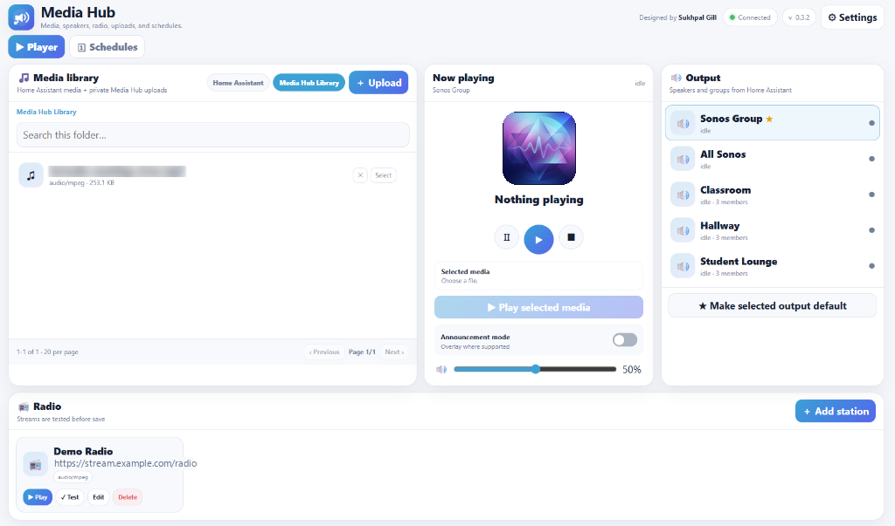

# Media Hub for Home Assistant

**Media Hub** is a universal media player and audio manager for Home Assistant, bringing together multi-room speaker control, internet radio, local media libraries, private browser uploads, and recurring automated playback into a single dashboard.

Designed by **Sukhpal Gill**.



## Why I built Media Hub

I was asked by a school to set up a school bell, so I built this smart Media Hub that would ring over Sonos speakers every 45 minutes when the period
changed. While building that system, I realized that managing audio files,
speaker groups, radio streams, and large recurring timetables could be much
easier from one dashboard.

What began as an automated bell system evolved into a complete **Universal Media Player** for Home Assistant—handling daily music playback, multi-room speaker grouping, live radio streaming, and automated audio schedules from one clean dashboard.

## Features

- Browse Home Assistant's existing media library.
- Private Media Hub audio library with browser uploads.
- Multi-file audio upload and file deletion.
- 20 media items per page with Previous/Next controls and scrolling.
- Automatic Home Assistant speaker and media-player group discovery.
- Sonos-friendly speaker/group playback workflows.
- Save a default output and identify it with a star.
- Play, pause, stop, volume, and optional announcement controls.
- Now Playing information and artwork when available.
- Play buttons switch to Stop while playback is active.
- Add, test, edit, play, and delete custom internet radio stations.
- Follow redirects and common M3U/PLS playlists.
- Audio MIME detection and tokenized LAN stream proxy for network speakers.
- Verify real playback state before reporting a radio stream as playing.
- Weekly recurring playback schedules.
- Saved, ordered playlists with automatic next-song playback and optional repeat.
- Schedule lunch and recess playlists with a speaker/group, volume, and stop time.
- One-time calendar-date schedules.
- Bulk-add many times to multiple weekdays.
- Different times can be maintained for each weekday.
- Flexible time entry: `09:05`, `0905`, `9:05`, `905`, `17:58`, `1758`.
- Choose the media file, output, volume, and announcement mode for each schedule.
- Enable/disable, edit, delete, and Run Now schedule controls.
- Uses the Home Assistant configured time zone.
- Runs continuously as a Home Assistant App.
- Automatic startup with Home Assistant.
- Home Assistant Ingress and sidebar access.
- Responsive desktop/mobile UI with light/dark support.
- Persistent settings, radio stations, schedules, and uploaded audio.

## Screenshots

### 1. Player & Home Assistant Media Library
Browse local Home Assistant audio, discover Sonos & Home Assistant speakers, play internet radio streams, and control playback.


### 2. Scheduled Playback & Timetables
Create weekly recurring or one-time calendar schedules with flexible bulk time entry.



### 3. Private Uploads Library
Upload private MP3 files directly from your browser to dedicated persistent add-on storage.



## Install

[](https://my.home-assistant.io/redirect/supervisor_add_addon_repository/?repository_url=https%3A%2F%2Fgithub.com%2Fonlinegill%2FMedia-Hub)

Alternatively, in Home Assistant:

1. **Settings → Add-ons → Add-on Store → ⋮ → Repositories**
2. Add the URL of this GitHub repository:
   ```text
   https://github.com/onlinegill/Media-Hub
   ```
3. Refresh the Add-on Store, and install **Media Hub**.

Start the App once. It is configured to start automatically on future Home
Assistant boots.

## Network requirement

Network speakers fetch media from Media Hub on **TCP port 8100**. The Home
Assistant host must be reachable from the speaker network on that port.

## Persistent storage

Media Hub configuration:

```text
/data/media_hub.json
```

Private uploaded media:

```text
/data/library/
```

Existing Home Assistant media is read from the standard read-only media mount.

## Privacy

This public repository contains no preconfigured radio stations, speaker entity
IDs, device IDs, timetable entries, uploaded audio, or user schedules. Those are
created and stored locally by each Media Hub installation.

## Version

**1.0.1 — Current release**

## License

This project is licensed under the MIT License - see the [LICENSE](LICENSE) file for details.
